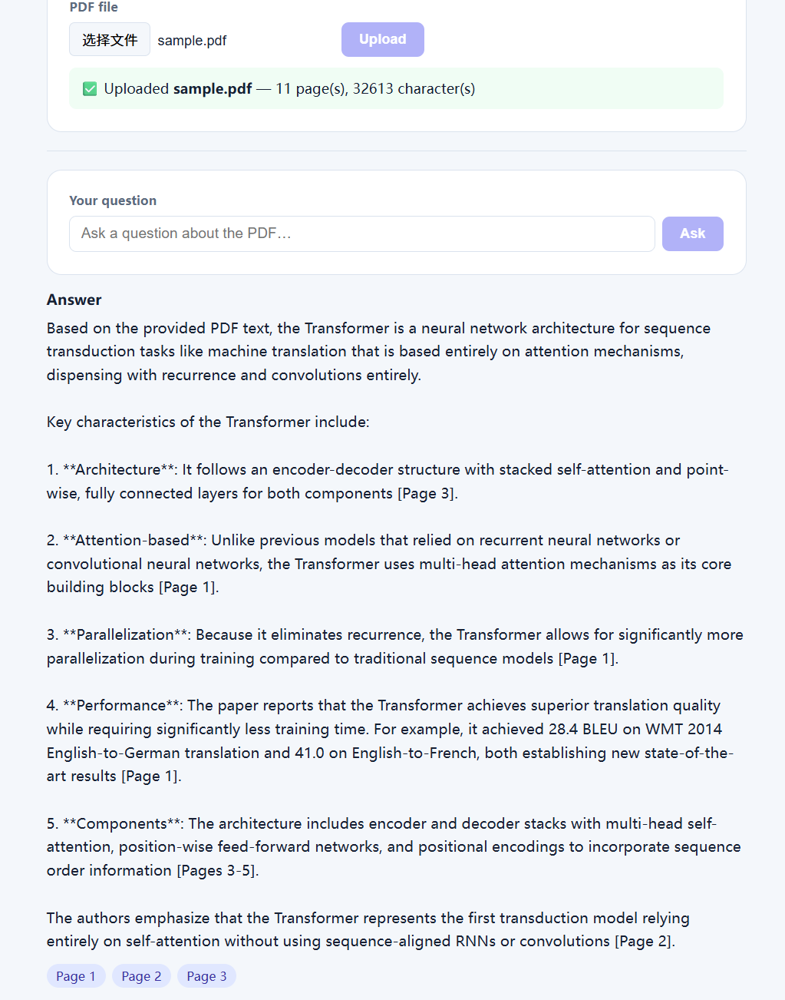

# Day 2 End-to-End Test Results

**Date:** 2026-08-02
**Branch:** feature/day2-lite

## Test Environment
- Backend: `http://127.0.0.1:8000`
- Frontend: `http://localhost:5173`
- Test PDF: `test_files/sample.pdf`

---

## Acceptance Tests

### 1. Upload disabled until file selected
- [x] Reload page → Upload button is disabled
- [x] Select a PDF → Upload button becomes enabled
- **Result:** ✅ PASS

### 2. Valid PDF uploads through `/upload?chat_id=day2-demo`
- [x] Click Upload → Network shows `POST /upload?chat_id=day2-demo` with 200
- [x] Page shows ✅ Uploaded with filename + page count
- **Result:** ✅ PASS

### 3. Ask disabled before upload / blank message
- [x] Before upload: chat input + Ask button are disabled
- [x] After upload: chat input enabled, Ask disabled when input is blank
- [x] Type a message → Ask becomes enabled
- **Result:** ✅ PASS

### 4. Known message returns answer + Page chips
- [x] Type a question about the PDF content
- [x] Click Ask → Network shows `POST /chat` with 200
- [x] Answer text appears
- [x] Page chips (e.g. "Page 1", "Page 2") are visible
- **Result:** ✅ PASS

### 5. Absent-information message does not produce invented evidence
- [x] Ask about something NOT in the PDF
- [x] Answer should not cite fake pages
- [x] Citations (if any) match actual PDF content
- **Result:** ✅ PASS

### 6. Backend shutdown produces visible frontend error
- [x] Stop the backend (Ctrl+C on uvicorn terminal)
- [x] Click Ask → page shows "Failed to fetch" error (not a blank page or crash)
- **Result:** ✅ PASS — visible error displayed

### 7. Restart requires re-upload (in-memory state cleared)
- [x] Restart backend
- [x] Click Ask → error "No document found for chat_id 'day2-demo'" (in-memory state cleared)
- [x] Re-upload the PDF → Ask works again
- **Result:** ✅ PASS

---

## Screenshot

---

## Summary

- Passed: **7 / 7**
- Notes: 
  - Test 6 error was "Failed to fetch" (browser network error), displayed in red error box with `role="alert"`
  - Test 7 confirmed in-memory storage behavior — restart clears `documents` dict, user must re-upload
  - All 4 layers (React → fetch → FastAPI → PDF/LLM) verified end-to-end
